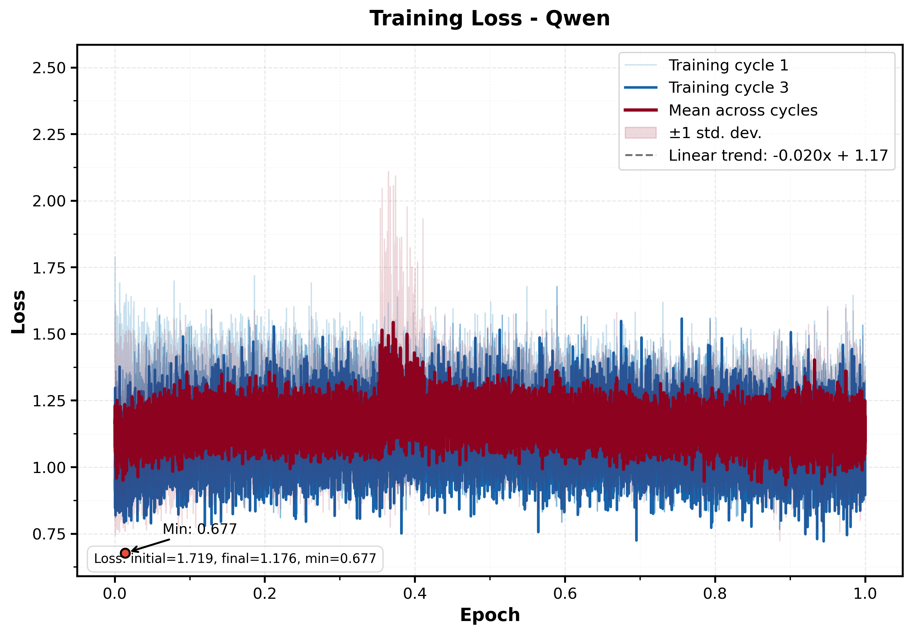

# A Pipeline to Fine-Tune Large Language Models for Bioinformatics Tools: Use Case—Polygenic Risk Score Tools

## Table of Contents

- [Problem Statement](#problem-statement)
- [Solution Overview](#solution-overview)
- [Project Steps](#project-steps)
- [Step 0 – Search for Tool-Related Documents](#step-0--search-for-tool-related-documents)
- [Step 1 – Download Content](#step-1-–-download-content-download-article-github-pdf-manual-and-website)
- [Step 2 – Process and Merge Content](#step-2-–-process-and-merge-content)
- [Step 3 – Generate Question-Answer Pairs](#step-3-–-generate-question-answer-pairs)
- [Step 4 – Check Downloaded Data Quality](#step-4-–-check-downloaded-data-quality)
- [Step 5 – Question Dataset Consolidation and Analysis](#step-5-–-question-dataset-consolidation-and-analysis)
- [Step 6 – Question-Answer Pair Quality Assessment](#step-6-–-question-answer-pair-quality-assessment)
- [Step 7 – Semantic Analysis and Data Splitting](#step-7-–-semantic-analysis-and-data-splitting)
- [Step 8 – Model Evaluation and Benchmarking](#step-8-–model-evaluation-and-benchmarking)
- [Step 9 – Large Language Model Fine-Tuning](#step-9-–-large-language-model-fine-tuning)
- [Step 10 – Response Quality Evaluation](#step-10-–-response-quality-evaluation)
- [Step 11 – Results Consolidation and Final Analysis](#step-11-–-results-consolidation-and-final-analysis)

## Problem Statement

Comparing multiple genetic analysis tools is traditionally challenging because it requires:

- Reading and understanding extensive documentation for each tool.
- Using web servers for benchmarking, which may involve uploading sensitive genetic data and raises privacy concerns. A better option would be to execute the tool locally.
- Relying on general-purpose language models (like ChatGPT) that have been trained on a wide range of tools, but may miss important details such as specific command-line flags or parameter options unique to each tool.

For example, when asking a general LLM how to run a PRS tool, it might omit required flags like `--bfile` or `--pheno` for PLINK, or provide incomplete commands because it was not specifically trained on the latest documentation for that tool. This can lead to errors or suboptimal usage.

## Solution Overview

By fine-tuning a Large Language Model (LLM) on the documentation and resources of polygenic risk score (PRS) tools, you can interact with the model to:

- Ask questions about tool features, usage, and comparisons.
- Request code snippets or example commands for running or benchmarking the tools, with accurate and complete parameter flags.
- Get automated, privacy-preserving assistance without manual review or sharing sensitive data.

## Project Steps

1. **Data Discovery**: Identify relevant documentation and resources for PRS tools.
2. **Data Downloading**: Automate the download of tool documentation, code, and related materials.
3. **Data Processing**: Clean and organize the downloaded data for further use.
4. **Data Transformation**: Convert the processed data into question-answer pairs suitable for LLM training.
5. **Model Fine-Tuning**: Fine-tune the LLM using the generated dataset.
6. **Model Evaluation**: Test the fine-tuned model's ability to answer questions, generate commands, and assist with benchmarking or code generation for the tools.

This pipeline enables efficient, automated comparison and usage of bioinformatics tools by leveraging LLMs for interactive support and code generation tailored to the specific requirements of each tool.

## Step 0 – Search for Tool-Related Documents

You can use advanced AI-powered search tools such as the Deep Research feature from [Claude](https://claude.ai/research) or [Perplexity](https://www.perplexity.ai/) to efficiently find up-to-date and comprehensive resources for each tool.

> **Note**: Keep the format same as mentioned in the `PRSGPT-Tools-DatasetLinks.xlsx` file.

Use the following instructions to create a comprehensive table of polygenic risk score (PRS) tools and their resources:

Prompt:

```
### Task: Create a comprehensive table (in Markdown format) of polygenic risk score (PRS) tools.

For each tool, include the following columns (links only):

- **Tool Name** – Name of the PRS tool
- **Tool PDF Document** – Link to a PDF user manual or guide. Leave blank if not available
- **GitHub Link** – Link to the GitHub repository (if available)
- **R Package Link** – Link to the R package (if available)
- **Python Package Link** – Link to the Python package (if available)
- **Published Article** – Link to the main published article
- **DOI Link** – Direct DOI link to the publication
- **Website Link** – Official website of the tool (if available)

#### Instructions:

- Provide the response in **Markdown table format**
- Include **only links** in each table cell (no extra text or annotations)
- Leave any cell empty if the corresponding link is not available

### Example Table Format:

| Tool Name                                                            | Tool PDF Document                                                               | GitHub Link                                  | R Package Link                                   | Python Package Link | Published Article                                      | DOI Link                                                                   | Website Link                                              |
| -------------------------------------------------------------------- | ------------------------------------------------------------------------------- | -------------------------------------------- | ------------------------------------------------ | ------------------- | ------------------------------------------------------ | -------------------------------------------------------------------------- | --------------------------------------------------------- |
| [lassosum](https://rdrr.io/github/tshmak/lassosum/man/lassosum.html) |                                                                                 | [GitHub](https://github.com/tshmak/lassosum) | [GitHub](https://github.com/tshmak/lassosum.git) |                     | [Article](https://doi.org/10.1002/gepi.22050)          | [10.1002/gepi.22050](https://doi.org/10.1002/gepi.22050)                   |                                                           |
| [GCTA](https://yanglab.westlake.edu.cn/software/gcta/#SBLUP)         | [PDF](https://yanglab.westlake.edu.cn/software/gcta/static/gcta_doc_latest.pdf) | [GitHub](https://github.com/jianyangqt/gcta) |                                                  |                     | [Article](https://doi.org/10.1007/978-1-62703-447-0_9) | [10.1007/978-1-62703-447-0_9](https://doi.org/10.1007/978-1-62703-447-0_9) | [Website](https://yanglab.westlake.edu.cn/software/gcta/) |


```

Add more rows for additional tools as needed.

---

### Tool Information Fields:

- **Tool**: The name of the tool.
- **Tool Information**: Basic descriptive information about the tool.
- **PDF Manual**: Link to the PDF version of the tool's manual, if available.
- **Python**: Python package for the tool, if available.
- **R Package**: The complete R package for the tool, downloaded from GitHub or R repositories. Used to scan man pages and documentation.
- **GitHub Readme**: The README file from the tool's GitHub repository, often containing installation and usage instructions.
- **Website**: The official website for the tool. HTML pages were used to generate the website dataset.
- **Language**: The programming language(s) used to develop the tool.
- **Article**: Associated literature or articles, downloaded for information extraction and question generation.

## Step 1 – Download Content (Download Article, GitHub, PDF Manual, and Website)

```python
python Step1-DownloadContent.py
```

This is an automated content downloader that reads information about research tools from an Excel spreadsheet and downloads all their associated documentation and resources. Think of it as a "digital librarian" that systematically collects and organizes materials from various online sources.

This script is particularly useful for researchers, developers, or organizations who need to systematically collect and organize documentation for multiple software tools or research resources. Instead of manually visiting dozens of websites, GitHub repositories, and downloading papers one by one, this script automates the entire process.

The end result is a well-organized local library of all tool documentation that can be used for analysis, comparison, or offline reference.

### 1. **Data Input**

- Reads tool information from `PRSGPT-Tools-DatasetLinks.xlsx`
- The spreadsheet contains columns for each tool with links to different types of resources:
  - GitHub repositories (README files and code)
  - Official websites
  - Research articles (via DOI links)
  - R packages
  - Python packages
  - PDF manuals

### 2. **Directory Organization**

- Creates a structured folder system for each tool:
  ```
  Tools/
  └── [ToolName]/
      ├── GitHubReadme/     # GitHub repository files
      ├── Website/          # Complete website downloads
      ├── Article/          # Research papers
      ├── Rpackage/         # R package source code
      ├── PythonPackage/    # Python package source code
      └── PDFManual/        # PDF documentation
  ```

### 3. **Multi-Source Content Downloading**

For each tool, the script downloads different types of content:

- **GitHub Content**: Downloads README files, LICENSE files, contribution guidelines, and dependency files (requirements.txt, setup.py, etc.)
- **Websites**: Uses web scraping with Selenium to download complete websites including JavaScript-rendered content, following internal links up to 500 pages
- **Research Articles**: Downloads academic papers using DOI (Digital Object Identifier) links through scientific databases
- **R Packages**: Clones entire R package repositories from GitHub
- **Python Packages**: Clones Python package repositories from GitHub
- **PDF Manuals**: Downloads PDF documentation files directly

## Step 2 – Process and Merge Content

After downloading all the raw content, these scripts convert and organize the materials into clean, searchable text formats:

```python
python Step2.1-ConvertArticlesAndManualstoText.py
```

**PDF to Text Converter**: Uses the Marker library to extract clean text from PDF research articles and manuals. Processes all PDFs in each tool's Article and PDFManual directories, preserving document structure and content for further processing.

**Directory Structure Created:**

```
content/
├── ToolName/
│   ├── Article/
│   │   ├── paper1.pdf → paper1.txt
│   │   └── paper2.pdf → paper2.txt
│   └── PDFManual/
│       ├── manual1.pdf → manual1.txt
│       └── guide.pdf → guide.txt
```

```python
python Step2.2-ConvertWebSitetoMarkdown.py
```

**Website Content Processor**: Converts downloaded HTML/SHTML files to both clean text and Markdown formats. Removes duplicate pages automatically based on content hashing, and extracts meaningful content while filtering out navigation elements and scripts.

**Directory Structure Created:**

```
content/
├── ToolName/
│   ├── WebSite/
│   │   ├── page1.html → page1.txt + page1.md
│   │   ├── page2.shtml → page2.txt + page2.md
│   │   └── duplicates_removed.log
```

```python
python Step2.3-ConvertRPackageToTextandMerge.py
```

**R Package Content Merger**: Processes R package repositories by collecting all documentation files (.md, .Rmd, .rd), merging them into organized text files. Creates comprehensive summaries including file listings and combines all R-related content for easy analysis.

**Directory Structure Created:**

```
content/
├── ToolName/
│   ├── RPackage/
│   │   ├── original_files/ (unchanged)
│   │   ├── merged_content.txt
│   │   ├── file_listing.txt
│   │   └── combined_documentation.txt
```

```python
python Step2.4-ConvertPythonPackageToTextandMerge.py
```

**Python Package Content Merger**: Similar to the R processor but handles Python packages. Extracts content from Python files (.py), Jupyter notebooks (.ipynb), and Markdown files, parsing notebook cells and combining all Python-related documentation into merged text files.

**Directory Structure Created:**

```
content/
├── ToolName/
│   ├── PythonPackage/
│   │   ├── original_files/ (unchanged)
│   │   ├── merged_content.txt
│   │   ├── file_listing.txt
│   │   ├── notebook_outputs.txt
│   │   └── combined_documentation.txt
```

## Step 3 – Generate Question-Answer Pairs

This step transforms the processed content from Step 2 into question-answer pairs suitable for fine-tuning Large Language Models. Each script focuses on a specific type of content source and generates targeted questions that align with how users typically interact with bioinformatics tools.

All Step3 scripts require Google Gemini API access. Set your API key as an environment variable:

```bash
export GOOGLE_API_KEY="your_api_key_here"
```

Get your API key from: [Google AI Studio](https://aistudio.google.com/app/apikey)

### Step 3.1 - Generate Questions from GitHub Repository Content

```python
python Step3.1-GenerateQuestions-GitHub.py
```

**GitHub Content Question Generator**: Processes merged GitHub repository files, R package documentation, and README files to create questions focused on technical implementation and installation procedures.

**Focus Keywords**: Installation, setup, dependencies, configuration, technical implementation, repository structure, version requirements, compatibility

**Content Sources**:

- GitHub repository files (README, LICENSE, setup files)
- R package documentation (.md, .Rmd, .rd files)
- Combined repository content

**Directory Structure Created:**

```
Tools/
├── ToolName/
│   ├── GitHubQuestions/
│   │   ├── ToolName_all_questions.json
│   │   └── ToolName_chunk[N]_questions.json (if content is large)
│   └── Github.txt (merged content file)
```

**Sample Questions Generated:**

- "How do I install [Tool] and its dependencies?"
- "What are the system requirements for running [Tool]?"
- "How do I configure [Tool] for my environment?"

---

### Step 3.2 - Generate Questions from GitHub README Files

```python
python Step3.2-GenerateQuestions-GitHubReadMe.py
```

**README-Specific Question Generator**: Focuses exclusively on GitHub README files to create questions about installation instructions, quick start guides, and basic usage examples that are typically found in repository documentation.

**Focus Keywords**: Installation, execution, quick start, basic usage, getting started, command examples, prerequisites

**Content Sources**:

- GitHub README.md files only
- Installation sections
- Usage examples from README

**Directory Structure Created:**

```
Tools/
├── ToolName/
│   └── GitHubReadMeQuestions/
│       └── ToolName_readme_questions.json
```

**Sample Questions Generated:**

- "How do I quickly get started with [Tool]?"
- "What are the basic commands to run [Tool]?"
- "How do I install [Tool] from the command line?"

---

### Step 3.3 - Generate Questions from PDF Manuals

```python
python Step3.3-GenerateQuestions-Manual.py
```

**PDF Manual Question Generator**: Processes comprehensive PDF documentation to create detailed questions about tool functionalities, parameter specifications, and advanced usage scenarios typically found in formal documentation.

**Focus Keywords**: Tool functionalities, parameters, options, flags, advanced usage, detailed procedures, specifications, comprehensive workflows

**Content Sources**:

- Converted PDF manual text files (from Step2.1)
- Technical documentation
- Parameter specifications

**Directory Structure Created:**

```
Tools/
├── ToolName/
│   └── ManualQuestions/
│       ├── ToolName_manual_questions.json
│       └── ToolName_chunk[N]_questions.json (if large content)
```

**Sample Questions Generated:**

- "What does the --parameter flag do in [Tool]?"
- "How do I set advanced configuration options in [Tool]?"
- "What are all the available output formats in [Tool]?"

---

### Step 3.4 - Generate Questions from Research Articles

```python
python Step3.4-GenerateQuestions-Article.py
```

**Research Article Question Generator**: Analyzes scientific papers and publications to create questions about theoretical foundations, methodologies, algorithm details, and research context behind the tools.

**Focus Keywords**: Scientific background, methodology, algorithms, theoretical foundation, research context, statistical methods, validation, benchmarking

**Content Sources**:

- Converted research article text (from Step2.1)
- Scientific publications
- Methodology sections

**Directory Structure Created:**

```
Tools/
├── ToolName/
│   └── ArticleQuestions/
│       ├── ToolName_article_questions.json
│       └── ToolName_chunk[N]_questions.json (if large content)
```

**Sample Questions Generated:**

- "What is the theoretical basis behind [Tool]'s algorithm?"
- "How does [Tool] compare to other methods in benchmarks?"
- "What statistical methods does [Tool] implement?"

---

### Step 3.5 - Generate Questions from Website Content

```python
python Step3.5-GenerateQuestions-Website.py
```

**Website Content Question Generator**: Processes website content to generate questions about command-line examples, web-based tutorials, and practical usage scenarios. Uses multithreading for efficient processing of large websites and supports multiple API keys for rate limiting.

**Focus Keywords**: Command-line examples, practical usage, tutorials, workflows, real-world applications, step-by-step guides

**Content Sources**:

- Converted website content (from Step2.2)
- Web tutorials
- Online documentation

**Directory Structure Created:**

```
Tools/
├── ToolName/
│   └── WebsiteQuestions/
│       ├── ToolName_website_questions.json
│       └── ToolName_chunk[N]_questions.json (if large content)
```

**Sample Questions Generated:**

- "How do I run a complete analysis workflow with [Tool]?"
- "What are some real-world examples of using [Tool]?"
- "How do I process my data step-by-step with [Tool]?"

**Special Features:**

- Multithreaded processing for faster generation
- Support for multiple API keys to handle rate limits
- Automatic load balancing across API keys

---

### Step 3.6 - Generate Questions from R Package Documentation

```python
python Step3.6-GenerateQuestions-Rpackage.py
```

**R Package Question Generator**: Processes R package documentation to create questions specifically about R functions, package usage, R-specific implementations, and R environment setup.

**Focus Keywords**: R functions, R execution, package usage, R environment, function parameters, R workflows, data objects

**Content Sources**:

- Merged R package content (from Step2.3)
- R documentation files
- Function descriptions

**Directory Structure Created:**

```
Tools/
├── ToolName/
│   └── RpackageQuestions/
│       ├── ToolName_rpackage_questions.json
│       └── ToolName_chunk[N]_questions.json (if large content)
```

**Sample Questions Generated:**

- "How do I use the main() function in the [Tool] R package?"
- "What R objects does [Tool] require as input?"
- "How do I load and configure the [Tool] R package?"

---

### Step 3.7 - Generate Questions from Python Package Code

```python
python Step3.7-GenerateQuestions-PythonPackage-Code.py
```

**Python Code Analysis Question Generator**: Analyzes Python source code to create questions about hyperparameters, implementation details, Python-specific usage, and code-level functionality understanding.

**Focus Keywords**: Hyperparameters, implementation details, Python usage, code functionality, class methods, function parameters, Python workflows

**Content Sources**:

- Python package source code (from Step2.4)
- Python implementation files
- Code documentation

**Directory Structure Created:**

```
Tools/
├── ToolName/
│   └── PythonPackageQuestions/
│       ├── ToolName_python_questions.json
│       └── ToolName_chunk[N]_questions.json (if large content)
```

**Sample Questions Generated:**

- "How do I set hyperparameters in the [Tool] Python implementation?"
- "What Python classes and methods are available in [Tool]?"
- "How do I customize the [Tool] algorithm parameters in Python?"

---

### Step 3.8 - Generate Questions from Jupyter Notebooks

```python
python Step3.8-GenerateQuestions-PythonPackage-JupyterNotebook.py
```

**Jupyter Notebook Question Generator**: Processes Jupyter notebooks to create questions about Python implementation examples, interactive usage patterns, data analysis workflows, and notebook-specific tutorials.

**Focus Keywords**: Python implementation, interactive usage, data analysis workflows, notebook tutorials, example code, practical demonstrations

**Content Sources**:

- Jupyter notebook content (from Step2.4)
- Notebook cells and outputs
- Interactive examples

**Directory Structure Created:**

```
Tools/
├── ToolName/
│   └── JupyterNotebookQuestions/
│       ├── ToolName_notebook_questions.json
│       └── ToolName_chunk[N]_questions.json (if large content)
```

**Sample Questions Generated:**

- "How do I implement [Tool] in a Jupyter notebook?"
- "What are some interactive examples of using [Tool] with Python?"
- "How do I visualize results from [Tool] in a notebook?"

---

### Summary

The Step3 scripts collectively generate approximately **400 question-answer pairs per tool** (50 questions × 8 different content sources), creating a comprehensive training dataset that covers:

- **Technical Implementation** (GitHub, Python Code)
- **User Guidance** (README, Manuals, Websites)
- **Scientific Context** (Research Articles)
- **Language-Specific Usage** (R Packages, Jupyter Notebooks)

Each generated question includes:

- **Complete command-line examples** with proper syntax
- **Detailed parameter explanations** with types and defaults
- **Source attribution** linking back to original documentation
- **Comprehensive answers** (~500 words when information is available)
- **Practical, runnable code** that users can directly implement

The resulting question-answer pairs are optimized for fine-tuning Large Language Models to provide accurate, tool-specific assistance for bioinformatics research.

## Step 4 – Check Downloaded Data Quality

```python
python Step4-CheckData.py
```

This script verifies that all downloaded content has been properly processed and that question-answer pairs have been successfully generated for each tool across all content sources.

- **Validates Pipeline Completeness**: Ensures all steps from content download through question generation have completed successfully
- **Identifies Missing Data**: Flags tools or content types that may need re-processing
- **Generates Success Metrics**: Provides quantitative assessment of pipeline performance

The script systematically examines each tool directory and verifies the presence of:

### Content Availability Checks:

- **PDF Manual Text**: `Tools/[ToolName]/PDFManual/*.txt` files (converted from PDF)
- **Article Text**: `Tools/[ToolName]/Article/*.txt` files (converted from PDF)
- **GitHub README**: `Tools/[ToolName]/GitHubReadme/README.md` files
- **Website Content**: `Tools/[ToolName]/Website/` directory with HTML/SHTML files
- **R Package Files**: `Tools/[ToolName]/Rpackage/` directory with >3 files
- **Python Package Files**: `Tools/[ToolName]/PythonPackage/` directory with Python files
- **Jupyter Notebooks**: `Tools/[ToolName]/PythonPackage/*.ipynb` files

### Question Generation Success Checks:

- **PDF Questions**: `Tools/[ToolName]/PDFManual/Questions_Merged.json`
- **Article Questions**: `Tools/[ToolName]/Article/Questions_Merged.json`
- **GitHub Questions**: `Tools/[ToolName]/GitHubReadme/Questions.json`
- **Website Questions**: `Tools/[ToolName]/WebsiteQuestions/[ToolName]_merged_all_questions.csv`
- **R Package Questions**: `Tools/[ToolName]/Rpackage/Questions_Merged.json`
- **Python Code Questions**: `Tools/[ToolName]/PythonPackage/Questions_Merged.json`
- **Jupyter Questions**: `Tools/[ToolName]/PythonPackage/Questions_JupyterNotebook.json`

### Output


**Figure 1: Source Availability vs. Question Generation Analysis**

- **Panel (a)**: Bar chart comparing available sources vs. successful question generation across all content types
- **Panel (b)**: Scatter plot showing success rates with bubble sizes proportional to source counts
- Professional formatting following top-tier academic journal standards with colorbrewer-inspired color schemes


**Figure 2: Question Generation Summary Statistics**

- Detailed breakdown by content source type showing availability counts, generation success, and success rates
- Publication-ready table with professional typography and layout suitable for research papers
- Includes overall pipeline performance metrics

```
================================================================================
SUMMARY OF QUESTION GENERATION SUCCESS
================================================================================
PDF Manual: 7 sources available, 7 with questions generated (100.0%)
Research Article: 26 sources available, 26 with questions generated (100.0%)
GitHub README: 32 sources available, 32 with questions generated (100.0%)
Project Website: 11 sources available, 11 with questions generated (100.0%)
R Package: 12 sources available, 12 with questions generated (100.0%)
Python Code: 11 sources available, 10 with questions generated (90.9%)
Jupyter Notebook: 2 sources available, 2 with questions generated (100.0%)
================================================================================
Overall: 101 total sources, 100 with questions generated (99.0%)
================================================================================
```

### Troubleshooting Failed Question Generation

If the script identifies tools with failed question generation (success rate < 100%), follow these steps:

2. **Adjust Chunk Size**: In the relevant Step3 script that failed, modify the chunk size parameter:

   ```python
   # In Step3.X-GenerateQuestions-*.py files
   # Look for lines like:
   chunk_size = 50000  # Reduce this value

   # Change to smaller chunks:
   chunk_size = 25000  # or even smaller: 10000
   ```

3. **API Configuration**: Ensure your Google Gemini API key has sufficient quota and rate limits are not exceeded.

This high success rate (99.0%) demonstrates the robustness of the automated pipeline in processing diverse bioinformatics tool documentation and generating comprehensive question-answer datasets for LLM fine-tuning.

## Step 5 – Question Dataset Consolidation and Analysis

```python
python Step5-MergeQuestions.py
```

This script consolidates all generated questions from multiple sources and performs data quality optimization.

### Files Analyzed

Systematically scans all tool directories and counts questions by source type:

- `Tools/[ToolName]/Article/Questions_Merged.json` (Research articles)
- `Tools/[ToolName]/GitHubReadme/Questions.json` (GitHub README)
- `Tools/[ToolName]/GitHubQuestions/[ToolName]_all_questions.json` (GitHub repository)
- `Tools/[ToolName]/PythonPackage/Questions_Merged.json` (Python code)
- `Tools/[ToolName]/PDFManual/Questions_Merged.json` (PDF manuals)
- `Tools/[ToolName]/Rpackage/Questions_Merged.json` (R packages)
- `Tools/[ToolName]/WebsiteQuestions/[ToolName]_merged_all_questions.csv` (Website content)

### Format Conversion

Standardizes question formats across different sources:

- `instruction*` fields → `Question` (handles instruction, instruction1, instruction2, etc.)
- `output*` fields → `output` (handles output, output1, output2, etc.)
- Adds `ToolName` as source attribution

### Quality Filtering

Filters questions based on answer quality:

- Minimum answer length: 30 words
- Removes questions with insufficient or incomplete answers
- Ensures high-quality training data for LLM fine-tuning

### Duplicate Removal

Uses machine learning techniques for duplicate removal:

- **TF-IDF Vectorization**: Converts questions to numerical representations
- **Cosine Similarity**: Measures semantic similarity between questions
- **Smart Retention**: Keeps questions with longer, more comprehensive answers

**Parameters:**

- Default similarity threshold: 95%
- Configurable threshold for different quality requirements

### Output

- `Allquestions.json` - Final consolidated dataset ready for LLM training


_Figure 5: Final distribution of questions after all filtering and quality checks_


_Figure 6: Final statistical distribution showing the cleaned and validated dataset_

### Visualizations

- t-SNE visualization of question embeddings colored by source type
- Shows natural groupings and overlap between different content sources


_Figure 9: Alternative white background version of clustering analysis suitable for print publications_

### Console Output Example

```
                Tool  Article_Questions  Github_Readme_Questions  Github_Questions  ...
0               BOLT                156                       48                94  ...
1               GCTA                123                       52                87  ...
2          lassosum                 89                       41                76  ...
...

Total Article Questions: 2,847
Total GitHub Readme Questions: 1,632
Total GitHub Questions: 2,156
Total Python Questions: 987
Total PDF Questions: 456
Total R Questions: 1,234
Total Website All Questions: 3,421
Grand Total Questions: 12,733

Generating publication-quality visualization...
Generating distribution visualization...
```

### Data Quality Metrics

**Typical Processing Results:**

- **Initial Question Count**: ~15,000-20,000 questions
- **After Deduplication**: ~12,000-15,000 questions (15-25% reduction)
- **After Quality Filtering**: ~10,000-13,000 questions (additional 10-15% reduction)
- **Final Dataset**: High-quality, comprehensive question-answer pairs ready for training

## Step 6 – Question-Answer Pair Quality Assessment

```python
python Step6-AnalysisOfQuestion-AnswerPair.py
```

This script evaluates the quality and coherence of question-answer pairs generated in previous steps using Natural Language Inference (NLI) models. It determines whether the generated answers actually address their corresponding questions effectively.

### Input Data Structure

Processes `Allquestions.json` with entries containing:

```json
{
  "Question": "How do I install PLINK and configure it for PRS analysis?",
  "output": "To install PLINK for PRS analysis, download from...",
  "ToolName": "PLINK",
  "SourceType": "GitHub"
}
```

### Sample Analysis Results

Based on the provided console output:

```
=== Technical Question Answering Analysis ===
Model used: longformer with 4096 token limit
Total entries analyzed: 1000

Question/Output Statistics:
    Total pairs: 1000
    Questions answered: 1000 (100.00%)
    Average score: 60.86/100
    Median score: 60.78/100

Combined Statistics:
    Total questions analyzed: 1000
    Total questions answered: 1000 (100.00%)
    Entries with at least one answered question: 1000 (100.00%)

Chunking statistics:
    Entries requiring chunking: 0 (0.00%)
    Total chunks processed: 0
```

- **Perfect Answer Coverage**: 100% of questions have relevant answers
- **Good Answer Quality**: Average score of 60.86/100 indicates moderately high relevance
- **Consistent Performance**: Median score (60.78) close to average suggests consistent quality
- **Efficient Processing**: No chunking required indicates well-sized content for the model

### Output

Enhanced dataset with quality annotations:

```json
{
  "Question": "How do I run PLINK for GWAS analysis?",
  "output": "To run PLINK for GWAS analysis...",
  "ToolName": "PLINK",
  "SourceType": "Manual",
  "question_answering_analysis": {
    "output_analysis": {
      "Question_output": {
        "is_answered": true,
        "score": 75.8,
        "confidence": 0.758,
        "method": "full_text"
      }
    },
    "processing_info": {
      "max_token_length": 4096
    }
  }
}
```

Comprehensive quality metrics:

```json
{
  "total_entries": 28378,
  "analyzed_entries": 1000,
  "question_output": {
    "total": 1000,
    "answered": 1000,
    "percentage_answered": 100.0,
    "avg_score": 60.86,
    "median_score": 60.78
  },
  "chunking_stats": {
    "entries_requiring_chunking": 0,
    "percentage_chunked": 0.0,
    "total_chunks_processed": 0
  },
  "model_info": {
    "max_token_length": 4096
  }
}
```

### Usage and Configuration

#### Model Selection

The script provides interactive model selection:

```python
# Available models:
# 1. Longformer (supports up to 4096 tokens)
# 2. DeBERTa (supports up to 2048 tokens)
# 3. RoBERTa-MNLI (supports up to 512 tokens)
# 4. Llama 3.3 (supports up to 8192 tokens)
# 5. Original QNLI-ELECTRA (supports up to 512 tokens)

model_choice = 1  # Default: Longformer
```

#### Sample Size Configuration

```python
sample_size = 1000  # Analyze subset for faster processing
# Set to None or 0 to analyze full dataset
```

This comprehensive quality assessment ensures that the final training dataset contains only high-quality, relevant question-answer pairs, leading to more effective LLM fine-tuning for bioinformatics tool assistance.

## Step 7 – Semantic Analysis and Data Splitting

This script performs semantic analysis and cluster-based data splitting using machine learning techniques to create training, validation, and test datasets that maintain semantic diversity while ensuring balanced representation across all clusters.

### Purpose

- **Semantic Clustering**: Group questions by semantic similarity using advanced embedding techniques
- **Dimensional Reduction**: Apply UMAP for high-quality 2D visualization of question semantics
- **Cluster-based Splitting**: Create balanced train/validation/test splits that preserve semantic diversity

### **Input and Output Structure**

#### **Input Requirements**

```
Allquestions.json          # Merged questions from Step5
├── Question               # Question text
├── output                 # Answer text
├── ToolName              # Associated tool
├── SourceType            # Data source
└── [other metadata]      # Additional fields
```

#### **Generated Outputs**

**Dataset Files**:

```
Train_with_outliers.jsonl           # Training dataset (includes outliers)
Validation_with_outliers.jsonl      # Validation dataset (includes outliers)
Test_with_outliers.jsonl           # Test dataset (includes outliers)

Train_without_outliers.jsonl       # Training dataset (outliers removed)
Validation_without_outliers.jsonl  # Validation dataset (outliers removed)
Test_without_outliers.jsonl       # Test dataset (outliers removed)
```

**Visualization Files**:

```
semantic_distribution_with_outliers.png     # Cluster visualization (outliers included)
semantic_distribution_without_outliers.png  # Cluster visualization (outliers removed)
```

#### **Sample Console Output**

```
Loading data from Allquestions.json...
Loaded 47834 items
Created 47834 prompt/completion pairs
Generating semantic embeddings...
100%|██████████| 47834/47834 [02:15<00:00, 352.89it/s]

Performing dimensionality reduction with UMAP...
Finding optimal number of clusters...
Min cluster size 10 produced 156 clusters with silhouette score: 0.2847
Min cluster size 15 produced 124 clusters with silhouette score: 0.3156
Min cluster size 20 produced 98 clusters with silhouette score: 0.3523
Optimal min_cluster_size: 25 with silhouette score: 0.3641

Found 1247 outliers (2.6% of data)
Created 142 semantic clusters (excluding outliers)

Total groups: 47834, Total samples: 47834
Cluster proportions: {0: 0.023, 1: 0.018, 2: 0.031, ..., -1: 0.026}

Actual allocation - Train: 42334, Val: 5000, Test: 500

Semantic Diversity Results:
Train set: 0.8234
Validation set: 0.8156
Test set: 0.8098

Outlier Percentages (included in datasets):
Train set: 2.7% (1143 out of 42334)
Validation set: 2.1% (105 out of 5000)
Test set: 2.0% (10 out of 500)
Total clusters: 142
```

#### **Dataset Size Configuration**

```python
test_size = 500        # Test set size
val_size = 5000        # Validation set size
# Remaining data allocated to training
```

#### **Visualization Components**


_UMAP visualization showing semantic clustering and dataset distribution across train/validation/test splits. Different colors represent different datasets, with density contours indicating cluster boundaries. Outliers are marked with star symbols._

### **Usage Instructions**

#### **Basic Execution**

```bash
python Step7-SemanticAnalysisAndSplitting.py
```

#### **With Outlier Removal**

```python
# Modify the script's main function
remove_outliers = True
main(remove_outliers=remove_outliers)
```

This semantic analysis and splitting approach ensures that the final datasets maintain high semantic diversity while providing balanced representation across all question types, creating optimal conditions for effective LLM fine-tuning in the bioinformatics domain.

## Step 8 – Model Evaluation and Benchmarking

Step 8 provides comprehensive model evaluation for assessing both pre-trained and pre-fine-tuned language models on bioinformatics question-answering tasks.

### Step 8.1: Google AI Model Evaluation

**File**: `Step8-EvaluateTestSetGoogleAI.py`

**Purpose**: Evaluates Google's Generative AI models (Gemini) on the test dataset using comprehensive metrics.

#### **Technical Implementation**

```python
def generate_completion_with_genai(prompt: str, model_name: str, api_key: str,
                                  temperature: float = 0.7, max_tokens: int = 1024):
    # Enhanced prompt with instruction
    enhanced_prompt = f"""Please provide only the direct answer to this question without any additional text or explanations:

{prompt}"""

    # Generation configuration
    generation_config = {
        "temperature": temperature,
        "top_p": 0.95,
        "top_k": 40,
        "max_output_tokens": max_tokens,
    }
```

### Step 8.2: Local Model Evaluation

**File**: `Step8-EvaluateTestSetLocal.py`

**Purpose**: Evaluates locally hosted models (Mistral, Llama, Qwen, Phi) using Transformers library.

#### **Technical Implementation**

```python
def load_model_and_tokenizer(model_name: str, model_path: str = None):
    # Model loading with optimization
    tokenizer = AutoTokenizer.from_pretrained(model_path or model_name)
    model = AutoModelForCausalLM.from_pretrained(
        model_path or model_name,
        torch_dtype=torch.float16,
        device_map="auto",
        trust_remote_code=True
    )
    return model, tokenizer
```

Both evaluation scripts implement 19+ evaluation metrics:

#### **Text Similarity Metrics**

```python
# Lexical Similarity
- exact_match: Binary exact string matching
- levenshtein_similarity: Edit distance-based similarity
- jaccard_similarity: Set-based token overlap
- tfidf_cosine_similarity: TF-IDF vector cosine similarity

# Semantic Similarity
- spacy_similarity: SpaCy word vector similarity
- sbert_similarity: Sentence-BERT embedding similarity
- wmd_similarity: Word Mover's Distance similarity
```

#### **NLP Evaluation Metrics**

```python
# Standard NLP Metrics
- rouge1/rouge2/rougeL: Recall-Oriented Understudy metrics
- bleu1/bleu4: BiLingual Evaluation Understudy scores
- meteor: Metric for Evaluation of Translation with Explicit ORdering
- bertscore_*: BERT-based semantic evaluation
```

#### **Code-Specific Metrics**

```python
# Bioinformatics Code Evaluation
- code_keyword_match: Domain-specific keyword matching
- codebert_similarity: CodeBERT-based code similarity
- hybrid_text_code_score: Combined text and code evaluation
```

### Step 8.4: Result Merging and Analysis

**File**: `Step8.1-MergeResults.py`

**Purpose**: Consolidates evaluation results from multiple models into comparative analysis.

### **Evaluation Results Summary**

Based on comprehensive evaluation across 19+ metrics:

| Metric                  | gemini-2.5-flash | llama-3.2-3B | phi-4      | qwen2.5-7B | **mistral-7B** |
| ----------------------- | ---------------- | ------------ | ---------- | ---------- | -------------- |
| exact_match             | 0.0              | 0.0          | 0.0        | 0.0        | 0.0            |
| levenshtein_similarity  | 0.1054           | 0.2070       | 0.1910     | 0.2133     | **0.2242**     |
| jaccard_similarity      | 0.0894           | 0.1834       | 0.1591     | **0.1924** | 0.1902         |
| tfidf_cosine_similarity | 0.2047           | 0.3792       | 0.2688     | **0.3946** | 0.3914         |
| rouge1                  | 0.0955           | 0.2265       | 0.1932     | **0.2441** | 0.2342         |
| rouge2                  | 0.0262           | 0.0684       | 0.0488     | **0.0755** | 0.0659         |
| rougeL                  | 0.0874           | 0.2097       | 0.1795     | **0.2288** | 0.2154         |
| bleu1                   | 0.0405           | 0.2066       | 0.1773     | 0.2048     | **0.2339**     |
| bleu4                   | 0.0132           | 0.0517       | 0.0386     | 0.0519     | **0.0534**     |
| bleu_codenn             | 0.0095           | 0.0373       | 0.0321     | 0.0372     | **0.0400**     |
| code_keyword_match      | —                | **0.1704**   | 0.1418     | 0.0972     | 0.1146         |
| codebert_similarity     | 0.9358           | 0.9784       | 0.9781     | 0.9827     | **0.9831**     |
| hybrid_text_code_score  | 0.1329           | 0.2415       | 0.2326     | **0.2708** | 0.2632         |
| meteor                  | 0.0627           | 0.2293       | 0.2164     | 0.2397     | **0.2639**     |
| spacy_similarity        | 0.7967           | 0.9334       | 0.9253     | 0.9167     | **0.9386**     |
| sbert_similarity        | 0.4041           | 0.7055       | 0.6059     | 0.7275     | **0.7287**     |
| wmd_similarity          | 0.4838           | 0.5564       | 0.5388     | 0.5577     | **0.5626**     |
| entailment_score        | 0.5018           | 0.5036       | **0.5067** | 0.4863     | 0.5026         |
| bertscore_precision     | **0.8556**       | 0.8429       | 0.8243     | 0.8328     | 0.8336         |
| bertscore_recall        | 0.7822           | 0.8299       | 0.8308     | 0.8318     | **0.8376**     |
| bertscore_f1            | 0.8169           | **0.8359**   | 0.8270     | 0.8319     | 0.8354         |

#### **Key Performance Insights**

- **Mistral-7B** shows the strongest overall performance across lexical and semantic metrics
- **Qwen2.5-7B** excels in ROUGE scores and TF-IDF similarity
- **Llama-3.2-3B** demonstrates good balance with highest code keyword matching
- **Phi-4** shows competitive performance in entailment evaluation
- **Gemini-2.5-Flash** leads in BERTScore precision but lags in other metrics

## Step 9 – Large Language Model Fine-Tuning

Step 9 provides comprehensive fine-tuning implementations for multiple state-of-the-art language models specifically optimized for bioinformatics question-answering tasks. Each script uses the Unsloth optimization framework for efficient training.

### Step 9.2: Qwen Model Fine-Tuning

**File**: `Step9.2-FinetuneQwenModel.py`

**Purpose**: Fine-tunes Qwen2.5-7B model with optimized configurations for multilingual bioinformatics tasks.

#### **Model Specifications**

- **Base Model**: Qwen2.5-7B-Instruct
- **Optimization**: 4-bit quantization with LoRA
- **Specialization**: Multilingual support and code generation
- **Context Length**: Extended sequence length handling

### Step 9.3: Llama Model Fine-Tuning

**Files**: `Step9.3-FinetuneLlama3.2.py`, `Step9.3-FinetuneLlama3.py`

**Purpose**: Fine-tunes Llama models (3.2-3B and original Llama-3) with specialized configurations.

### Step 9.4: Phi Model Fine-Tuning

**File**: `Step9.4-FinetunePhiModel.py`

**Purpose**: Fine-tunes Microsoft Phi-4 model optimized for reasoning and code generation.

### Step 9.5: Gemma Model Fine-Tuning

**File**: `Step9.5-FinetuneGemmaModel.py`

**Purpose**: Fine-tunes Google Gemma model with safety-focused optimization.

### **Basic Fine-Tuning**

```bash
# Mistral fine-tuning
python Step9.1-FinetuneMistralModel.py

# Qwen fine-tuning
python Step9.2-FinetuneQwenModel.py

# Llama fine-tuning
python Step9.3-FinetuneLlama3.2.py
python Step9.3-FinetuneLlama3.py

# Phi fine-tuning
python Step9.4-FinetunePhiModel.py

# Gemma fine-tuning
python Step9.5-FinetuneGemmaModel.py
```

### **Output Structure**

Each fine-tuning script generates:

```
model_outputs/
├── checkpoint-[step]/       # Training checkpoints
├── training_loss.csv        # Detailed loss logs
├── training_plots.png       # Comprehensive training visualizations
├── evaluation_results.csv   # Model evaluation metrics
├── final_model/            # Final fine-tuned model
└── tensorboard_logs/       # TensorBoard training logs
```

## Step 10 – Response Quality Evaluation

**File**: `Step10-EvaluateResponse.py`

**Purpose**: Provides comprehensive evaluation of model responses using advanced NLP metrics and domain-specific assessment criteria for bioinformatics question-answering tasks.

This script provides a comprehensive framework for evaluating the similarity between reference and generated responses from natural language generation models. It integrates a wide range of metrics covering lexical, semantic, and structural aspects, including:

### **Usage**

```bash
python Step10-EvaluateResponse.py
```

### **Output Structure**

The script generates:

```
outputs_[model]/
├── detailed_metrics_all.csv       # All responses metrics
├── detailed_metrics_code.csv      # Code-containing responses
├── detailed_metrics_non_code.csv  # Non-code responses
├── detailed_metrics_results.json  # Complete results in JSON
└── raw_responses_epoch_*.jsonl    # Raw responses by epoch
```

## Step 11 – Results Consolidation and Final Analysis

**File**: `Step11-MergeFinetunedResults.py`

**Purpose**: Consolidates evaluation results from all fine-tuned models to provide comprehensive performance comparison and identify the best-performing model configurations.

### **Usage**

```bash
python Step11-MergeFinetunedResults.py
```

### **Sample Output**

```
outputs_phi/detailed_metrics_all.csv does not exist.
| | Epoch | Exact Match | Levenshtein Sim | Jaccard Sim | TF-IDF Cosine | ROUGE-1 | ROUGE-2 | ROUGE-L | BLEU-1 | BLEU-4 | METEOR | spaCy Sim | SBERT Sim | WMD Sim | Entailment | model Name |
|---:|--------:|--------------:|------------------:|--------------:|----------------:|----------:|----------:|----------:|---------:|----------:|---------:|------------:|------------:|----------:|-------------:|:-----------------|
| 0 | 1 | 0 | 0.271511 | 0.245736 | 0.405887 | 0.366372 | 0.142981 | 0.247471 | 0.324681 | 0.0953362 | 0.290405 | 0.948908 | 0.773878 | 0.603314 | 0.229536 | outputs_llama3.3 |
| 1 | 2 | 0 | 0.389069 | 0.380931 | 0.573037 | 0.539785 | 0.296413 | 0.394316 | 0.475936 | 0.228291 | 0.444853 | 0.959702 | 0.856532 | 0.672787 | 0.280936 | outputs_qwen |
| 2 | 1 | 0 | 0.155047 | 0.235111 | 0.274574 | 0.219116 | 0.0794454 | 0.130569 | 0.235159 | 0.07307 | 0.304522 | 0.924416 | 0.761163 | 0.568392 | 0 | outputs_gemma |
```

## Final Results

| Metric                   | Description                                               | Best Unfine-Tuned | LLaMA 3.2-3B (Fine-tuned) | Qwen2.5-7B (Fine-tuned) | Gemma (Fine-tuned) | LLaMA Gain/Loss | Qwen Gain/Loss | Gemma Gain/Loss |
| ------------------------ | --------------------------------------------------------- | ----------------- | ------------------------- | ----------------------- | ------------------ | --------------- | -------------- | --------------- |
| Exact Match              | % of predictions exactly matching reference               | 0.0000            | 0.0000                    | 0.0000                  | 0.0000             | 0.0000 ❌       | 0.0000 ❌      | 0.0000 ❌       |
| Levenshtein Similarity   | Edit distance based similarity (higher = closer)          | 0.2473            | 0.2828                    | 0.2972                  | 0.1712             | +0.0355 ✅      | +0.0499 ✅     | -0.0761 ❌      |
| Jaccard Similarity       | Token overlap similarity                                  | 0.1914            | 0.2457                    | 0.3809                  | 0.2351             | +0.0543 ✅      | +0.1895 ✅     | +0.0437 ✅      |
| TF-IDF Cosine Similarity | Cosine similarity on TF-IDF vectors                       | 0.4250            | 0.4059                    | 0.5730                  | 0.2746             | -0.0191 ❌      | +0.1480 ✅     | -0.1504 ❌      |
| ROUGE-1                  | Unigram overlap between prediction and reference          | 0.2627            | 0.3664                    | 0.5398                  | 0.2191             | +0.1037 ✅      | +0.2771 ✅     | -0.0436 ❌      |
| ROUGE-2                  | Bigram overlap                                            | 0.0691            | 0.2964                    | 0.2964                  | 0.0794             | +0.2273 ✅      | +0.2273 ✅     | +0.0103 ✅      |
| ROUGE-L                  | Longest common subsequence overlap                        | 0.2392            | 0.3943                    | 0.3943                  | 0.1306             | +0.1551 ✅      | +0.1551 ✅     | -0.1086 ❌      |
| BLEU-1                   | Unigram precision                                         | 0.2434            | 0.4759                    | 0.4759                  | 0.2352             | +0.2325 ✅      | +0.2325 ✅     | -0.0082 ❌      |
| BLEU-4                   | 4-gram precision                                          | 0.0427            | 0.2283                    | 0.2283                  | 0.0731             | +0.1856 ✅      | +0.1856 ✅     | +0.0304 ✅      |
| METEOR                   | Alignment metric considering synonyms and paraphrases     | 0.2680            | 0.4449                    | 0.4449                  | 0.3045             | +0.1769 ✅      | +0.1769 ✅     | +0.0365 ✅      |
| spaCy Similarity         | Semantic similarity from spaCy embeddings                 | 0.9537            | 0.9489                    | 0.9597                  | 0.9244             | -0.0048 ❌      | +0.0060 ✅     | -0.0293 ❌      |
| SBERT Similarity         | Sentence-BERT based semantic similarity                   | 0.7552            | 0.7739                    | 0.8565                  | 0.7612             | +0.0187 ✅      | +0.1013 ✅     | +0.0060 ✅      |
| WMD Similarity           | Word Mover's Distance similarity (higher better)          | 0.5734            | 0.6033                    | 0.6728                  | 0.5684             | +0.0299 ✅      | +0.0994 ✅     | -0.0050 ❌      |
| Entailment Score         | Logical entailment score between prediction and reference | 0.5114            | 0.2295                    | 0.2809                  | 0.0000             | -0.2819 ❌      | -0.2305 ❌     | -0.5114 ❌      |

### Loss

Below are the output visualizations for each fine-tuned model:

| Model            | Output Visualization                         |
| ---------------- | -------------------------------------------- |
| **LLaMA 3.2-3B** |  |
| **Qwen2.5-7B**   |        |
| **Phi-4**        |              |
| **Gemma**        |            |

## Final Notes

This completes the pipeline to fine-tune models for bioinformatics datasets. Please interpret the results carefully. The experiments were conducted on an NVIDIA H100 PCIe GPU (1 GPU, 79.179 GB memory) running Linux, with Torch 2.6.0+cu124, CUDA 12.4, and Triton 3.2.0. Bfloat16 was enabled.

You can use a GPU with 16GB memory for a limited number of Llama 3.2 or Qwen model runs.

### **Model Recommendations**

- **Qwen** and **Mistral**: Well-suited for chat and code-based tasks.
- **LLaMA 3.2**: Best for chat-based tasks.

### **Project Organization Summary**

The complete pipeline consists of:

- **12 main processing steps** (Step 0 through Step 11)
- **5 fine-tuned language models** with comprehensive evaluation
- **13+ PRS tools** with detailed documentation extraction
- **19+ evaluation metrics** for quality assessment
- **Automated data processing** with quality validation
- **Comprehensive visualization suite** for analysis and presentation

### **Reproducibility**

All scripts are designed for reproducibility with consistent random seeds and documented dependencies. The modular design allows for easy adaptation to other bioinformatics domains or tool sets.

### **Hardware Requirements**

- **Minimum**: 16GB GPU memory for limited model training
- **Recommended**: 80GB GPU memory (H100) for full pipeline execution
- **Storage**: Minimum 100GB for datasets and model outputs

If you encounter any issues or have questions about the code, please feel free to reach out.

---

## Author Information

- **Name**: Muhammad Muneeb
- **Affiliation**: The University of Queensland
- **Email**: [m.muneeb@uq.edu.au](mailto:m.muneeb@uq.edu.au)
- **Gmail**: [muneebsiddique007@gmail.com](mailto:muneebsiddique007@gmail.com)
- **GitHub**: [GitHub Profile](https://github.com/MuhammadMuneeb007/)
- **Google Scholar**: [Google Scholar](https://scholar.google.com/citations?hl=en&user=X0xdltIAAAAJ&view_op=list_works&sortby=pubdate)
- **ResearchGate**: [ResearchGate Profile](https://www.researchgate.net/profile/Muhammad-Muneeb-5)
- **Supervisor**: [David Ascher](https://scmb.uq.edu.au/profile/8654/david-ascher)
- **Group Webpage**: [BioSig Lab](https://biosig.lab.uq.edu.au/)
